# Manual de Administração - Fase 1

**Versão:** 1.0  
**Data:** 22 de agosto de 2026  
**Responsável operacional:** Raisa  
**Responsável técnico:** José

## 1. Começar em segurança

Este manual foi escrito para uma utilizadora sem experiência prévia em plataformas de comércio eletrónico. Use primeiro a administração própria da loja. O Payload CMS é uma área técnica e excecional.

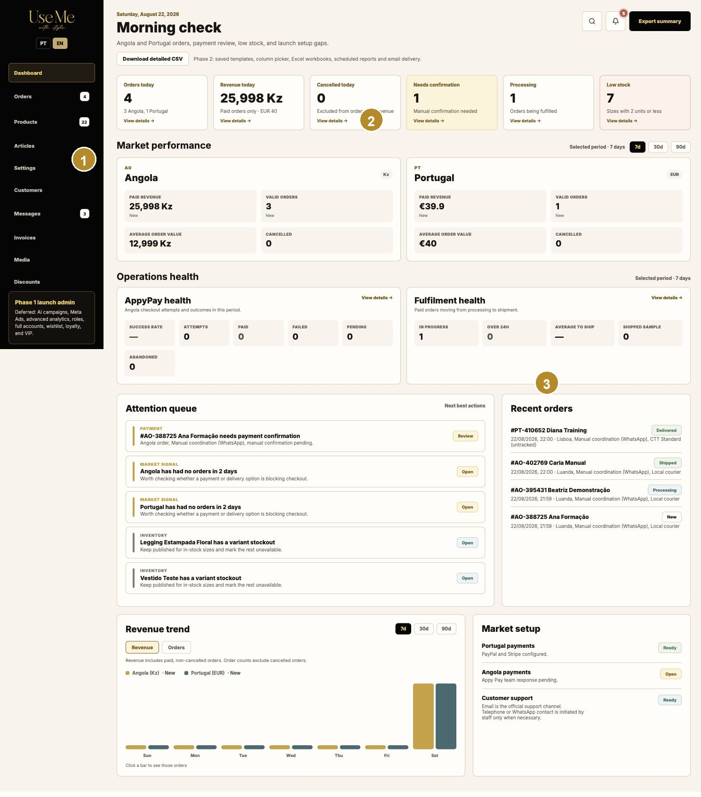

1 Navegação principal. 2 Pesquisa, notificações e exportação. 3 Indicadores e ações prioritárias.

### Iniciar e terminar sessão

> **AÇÃO SEGURA E ROTINEIRA**

1. Abra https://ao.usemewithstyle.shop/admin ou https://pt.usemewithstyle.shop/admin.
2. Introduza o endereço de email e a palavra-passe entregues separadamente.
3. Confirme que o nome da conta aparece no fundo da barra lateral.
4. No final, escolha Terminar sessão, sobretudo num computador partilhado.

### Mudar o idioma da administração

> **AÇÃO SEGURA E ROTINEIRA**

1. Use PT ou EN por baixo do logótipo. Esta escolha altera os rótulos da administração, não o idioma publicado na loja.
2. Ao editar conteúdo bilingue, preencha sempre os campos Português e English quando existirem.

### Interpretar os rótulos de segurança

> **CONFIRMAR ANTES DE PUBLICAR**

1. Ação segura e rotineira: pode executar no trabalho diário.
2. Confirmar antes de publicar: rever texto, preço, imagem e mercado antes de guardar.
3. Contactar o José primeiro: pagamentos, IVA, infraestrutura, integrações ou comportamento inesperado.
4. Ação de elevado impacto: eliminação, despublicação ou mudança que afete clientes existentes.

## 2. Rotina diária e painel

O painel resume encomendas, receita paga, confirmações pendentes, processamento, stock baixo, desempenho por mercado e saúde operacional.

1 Cartões de hoje. 2 Período de 7/30/90 dias. 3 Fila de atenção e tendências.

### Verificação da manhã

> **AÇÃO SEGURA E ROTINEIRA**

1. Abra o Dashboard e verifique Necessitam confirmação, Em processamento e Stock baixo.
2. Abra cada cartão em Ver detalhes para aplicar automaticamente o filtro correto.
3. Veja a Fila de atenção. Trate primeiro pagamentos, encomendas atrasadas e variantes sem stock.
4. Compare Angola e Portugal sem somar Kz e EUR. São moedas e mercados separados.

### Mudar o período

> **AÇÃO SEGURA E ROTINEIRA**

1. Escolha 7d, 30d ou 90d no bloco Desempenho por mercado ou Tendência de receita.
2. Selecione Receita ou Encomendas para mudar o gráfico.
3. Clique numa barra diária para abrir as encomendas desse dia.

### Exportar o resumo

> **CONFIRMAR ANTES DE PUBLICAR**

1. Escolha Exportar resumo para um relatório rápido do período atual.
2. Escolha Descarregar CSV detalhado quando precisar de linhas para análise.
3. Guarde os ficheiros com segurança: podem incluir dados pessoais e comerciais.

## 3. Encomendas, pagamento e expedição

A lista de encomendas permite pesquisar, filtrar, exportar e abrir cada encomenda. O detalhe controla pagamento, processamento, expedição, entrega e documentos.

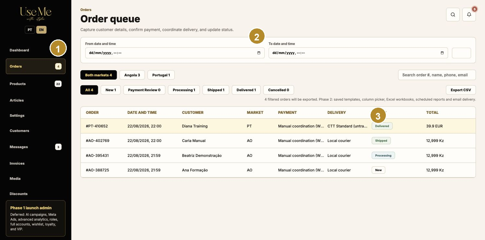

1 Pesquisa e filtros. 2 Estado, pagamento e mercado. 3 Exportação e abertura do detalhe.

### Encontrar uma encomenda

> **AÇÃO SEGURA E ROTINEIRA**

1. Abra Encomendas.
2. Pesquise pelo número, nome ou email.
3. Use mercado, estado, pagamento e datas para reduzir a lista.
4. Remova os filtros quando terminar para não esconder novas encomendas.

### Confirmar pagamento manual

> **AÇÃO DE ELEVADO IMPACTO**

1. Abra uma encomenda em Revisão de pagamento.
2. Confirme fora da aplicação que o pagamento foi realmente recebido.
3. Selecione Confirmar pagamento apenas uma vez.
4. A aplicação regista o pagamento, prepara a encomenda para processamento, gera o documento comercial interno e envia a confirmação por email.
5. Verifique o registo do evento, a fatura e o email. Não volte a clicar se a página demorar; atualize e confirme primeiro o estado.

> No lançamento com AppyPay, siga o estado confirmado pelo gateway. O fluxo WhatsApp permanece apenas como alternativa ativável.

### Processar e expedir

> **AÇÃO SEGURA E ROTINEIRA**

1. Depois do pagamento, marque a encomenda como Em processamento.
2. Compare artigos, variantes, quantidades e morada. A segunda linha da morada deve aparecer separadamente.
3. Prepare a encomenda e, quando sair, introduza o código CTT se aplicável.
4. Marque como Enviada. O cliente recebe o email de expedição.
5. Marque como Entregue apenas após confirmação de entrega.

### Cancelar

> **CONTACTAR O JOSÉ PRIMEIRO**

1. Uma encomenda só pode ser cancelada enquanto estiver em Novo.
2. Depois da confirmação do pagamento, o botão fica indisponível. Não force uma alteração por outro sistema.
3. Se existir pagamento confirmado, contacte o José para o procedimento correto; devoluções robustas ficam para a Fase 2.

### Imprimir e consultar documentos

> **CONFIRMAR ANTES DE PUBLICAR**

1. Use a guia de preparação para separar os artigos do armazém.
2. Abra a Fatura/PDF no registo da encomenda ou em Faturas.
3. O documento atual é comercial e interno; não é faturação fiscal certificada.

## 4. Produtos, imagens, preços e stock

Produtos controla tudo o que o cliente vê e pode comprar: fotografia, nomes bilingues, categoria, etiquetas, preços, promoção, variantes, stock e mercados.

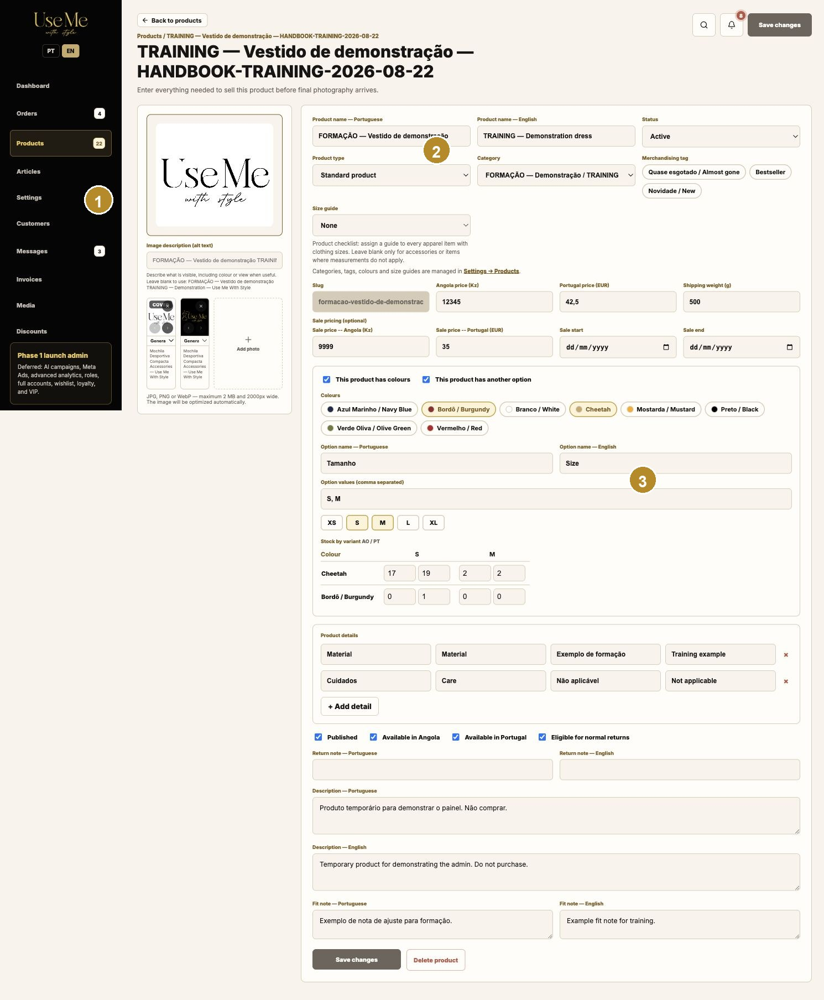

1 Galeria e associações de cor. 2 Dados comerciais e variantes. 3 Publicação, mercados e Guardar alterações.

### Criar um produto

> **CONFIRMAR ANTES DE PUBLICAR**

1. Abra Produtos e escolha Novo produto.
2. Preencha os nomes em português e inglês. O slug é criado automaticamente e não deve ser alterado.
3. Escolha Produto padrão ou Kit. Um produto padrão precisa de pelo menos uma variante; um kit precisa de componentes.
4. Escolha categoria, etiquetas de merchandising e guia de tamanhos quando aplicável.
5. Mantenha como Rascunho até terminar imagens, preços, descrições, stock e mercados.

### Adicionar e recortar fotografias

> **CONFIRMAR ANTES DE PUBLICAR**

1. Escolha Adicionar fotografia e selecione JPG, PNG ou WebP dentro dos limites apresentados.
2. No editor, ajuste enquadramento e zoom. Confirme a versão pedida antes de guardar.
3. A pré-visualização aparece antes da gravação. A fotografia só passa a fazer parte do produto depois de Guardar alterações.
4. Defina uma descrição alternativa útil. Se ficar vazia, a aplicação usa o nome do produto como alternativa.
5. Associe uma fotografia a uma cor quando só deva aparecer nessa cor. Deixe Geral para aparecer em todas as cores.
6. Escolha a fotografia de capa e ordene as restantes.

### Definir preço e promoção

> **CONFIRMAR ANTES DE PUBLICAR**

1. Introduza separadamente o preço AO em Kz e o preço PT em EUR.
2. O preço promocional tem de ser inferior ao preço normal.
3. As datas de início e fim são opcionais. Sem datas, a promoção fica ativa enquanto existir preço promocional.
4. Confirme no produto da loja que o preço normal aparece riscado e o promocional destacado.

### Gerir variantes e stock

> **AÇÃO SEGURA E ROTINEIRA**

1. Indique se o produto tem cores e/ou outra opção como tamanho ou capacidade.
2. Escolha as cores e introduza os valores separados por vírgulas.
3. Preencha stock AO e PT em cada combinação. São inventários independentes.
4. Zero significa esgotado nessa variante. Stock igual ou inferior a dois entra no alerta de stock baixo.
5. Nunca reduza stock para corrigir uma encomenda sem confirmar primeiro o histórico.

### Publicar por mercado

> **CONFIRMAR ANTES DE PUBLICAR**

1. Ative Publicado quando o produto estiver pronto.
2. Use Disponível em Angola e Disponível em Portugal para controlar cada loja.
3. Guarde e abra as duas lojas para confirmar nome, preço, stock, imagens e descrição.

### Eliminar ou despublicar

> **AÇÃO DE ELEVADO IMPACTO**

1. Prefira despublicar quando o artigo poderá regressar.
2. Eliminar remove o produto da administração e pode afetar ligações, artigos ou histórico operacional.
3. Antes de eliminar, confirme dependências e faça uma cópia dos dados necessários.

## 5. Categorias, etiquetas, cores e guias de tamanhos

Em Definições > Produtos pode criar estruturas reutilizáveis que passam automaticamente a estar disponíveis no editor de produto.

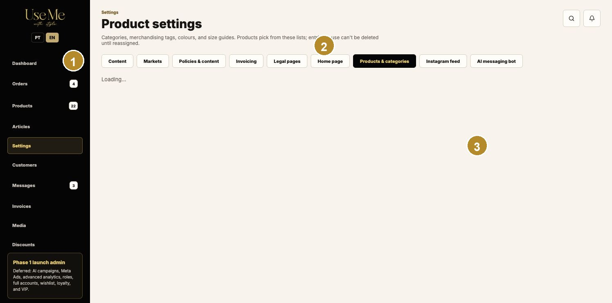

1 Tipos de definição. 2 Lista e criação. 3 Efeito no produto e na navegação da loja.

### Criar uma categoria

> **CONFIRMAR ANTES DE PUBLICAR**

1. Abra Definições > Produtos > Categorias.
2. Introduza nome PT, nome EN e texto introdutório em ambos os idiomas.
3. Adicione a imagem de mosaico e ajuste o recorte.
4. Guarde. A categoria fica disponível nos produtos e na navegação/filtros da loja.
5. Uma categoria em uso não pode ser eliminada até os produtos serem reatribuídos.

### Gerir etiquetas e cores

> **AÇÃO SEGURA E ROTINEIRA**

1. Crie etiquetas bilingues para distintivos como Novidade ou Bestseller.
2. Crie cores com nomes PT/EN e valor visual. A identidade interna permanece estável mesmo que o nome mude.
3. Associe etiquetas e cores no produto. Verifique cartões, seletores e galerias no storefront.

### Gerir guias de tamanhos

> **CONFIRMAR ANTES DE PUBLICAR**

1. Crie uma tabela reutilizável com rótulos e medidas.
2. Associe-a a todos os artigos de vestuário relevantes.
3. Use a nota de ajuste do produto para recomendações específicas.
4. Confirme o produto e a página pública Guia de tamanhos.

## 6. Clientes

Clientes é um registo operacional leve criado a partir das encomendas. Não é um sistema de contas de cliente.

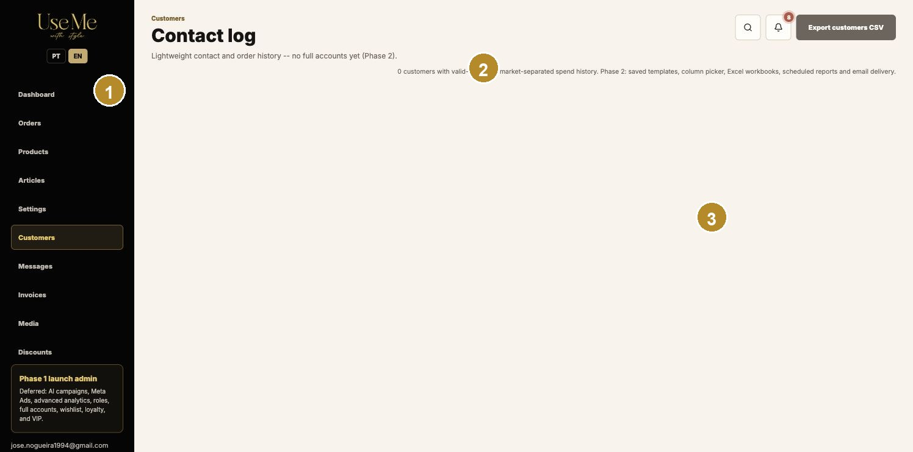

1 Pesquisa e exportação. 2 Dados de contacto. 3 Histórico de encomendas.

### Consultar e corrigir um cliente

> **CONFIRMAR ANTES DE PUBLICAR**

1. Abra Clientes e pesquise por nome ou email.
2. Abra o detalhe para ver contacto, mercado e encomendas associadas.
3. Corrija apenas erros confirmados. A alteração do cliente não reescreve automaticamente as moradas históricas das encomendas.
4. Use Exportar clientes apenas para uma finalidade operacional legítima.

### Proteger dados pessoais

> **AÇÃO DE ELEVADO IMPACTO**

1. Não partilhe exportações por canais públicos.
2. Não copie moradas, telefones ou emails para o manual ou capturas de ecrã.
3. Elimine ficheiros exportados quando deixarem de ser necessários.

## 7. Mensagens e assistência por Instagram

Mensagens reúne conversas de Instagram, estado da conversa, prioridades, relação com cliente/encomenda e apoio de rascunho por IA quando disponível.

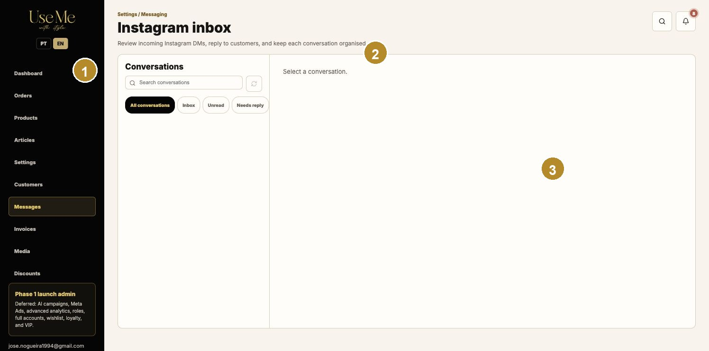

1 Lista de conversas. 2 Prioridade e estado. 3 Resposta, nota interna e associação.

### Tratar uma conversa

> **CONFIRMAR ANTES DE PUBLICAR**

1. Abra Mensagens e trate primeiro Prioridade e Necessita resposta.
2. Leia todo o contexto e confirme se existe cliente ou encomenda associada.
3. Use notas internas para informação que não deve ser enviada ao cliente.
4. Se existir rascunho de IA, confirme produto, preço, stock, mercado e política antes de aprovar.
5. Depois de responder, marque A aguardar cliente ou Concluída conforme o caso.

### Enviar uma resposta

> **CONFIRMAR ANTES DE PUBLICAR**

1. Escreva uma mensagem clara e profissional no idioma do cliente.
2. Não prometa stock, preço, prazo ou reembolso sem confirmação no sistema.
3. Ao enviar, a mensagem é transmitida para Instagram e fica registada na conversa.

### Falha de webhook ou envio

> **CONTACTAR O JOSÉ PRIMEIRO**

1. Não tente alterar tokens ou configurações técnicas.
2. Registe a hora, utilizador, texto do erro e captura de ecrã.
3. Contacte o José pelo canal de emergência acordado.

## 8. Faturas internas

A página Faturas lista documentos comerciais internos gerados pela aplicação. Pode filtrar por estado e mercado e abrir o PDF imutável.

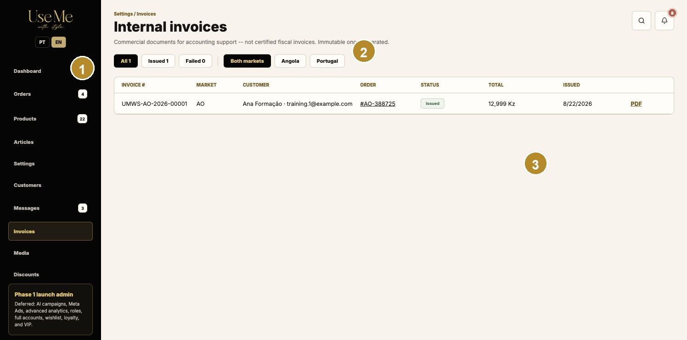

1 Filtros. 2 Número, cliente e encomenda. 3 Estado, total e PDF.

### Consultar uma fatura

> **CONTACTAR O JOSÉ PRIMEIRO**

1. Abra Faturas e filtre por Emitida/Falhou e por mercado.
2. Confirme número, encomenda, cliente, total e data.
3. Abra PDF para ver linhas, IVA, subtotal, envio e total pago.
4. Se o documento falhar, não gere números manualmente; contacte o José.

### Limite da Fase 1

> **CONFIRMAR ANTES DE PUBLICAR**

1. O PDF atual é um documento comercial interno para apoio contabilístico.
2. Não é uma fatura fiscal certificada. A integração SWEG/FactPlus será uma decisão futura.

## 9. Biblioteca de multimédia

A biblioteca apresenta cada imagem uma vez, as suas utilizações e o texto alternativo. A eliminação pode removê-la de vários locais.

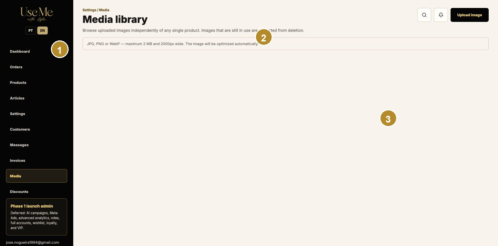

1 Pesquisa e carregamento. 2 Pré-visualização e texto alternativo. 3 Locais de utilização e eliminação.

### Carregar e reutilizar

> **AÇÃO SEGURA E ROTINEIRA**

1. Carregue JPG, PNG ou WebP dentro dos limites apresentados.
2. A aplicação otimiza o ficheiro. Confirme nitidez e enquadramento no local de utilização.
3. Antes de voltar a carregar uma imagem, pesquise se já existe.
4. Use o registo de utilizações para saber onde aparece.

### Eliminar uma imagem

> **AÇÃO DE ELEVADO IMPACTO**

1. Abra as utilizações e confirme todos os produtos, categorias ou conteúdos associados.
2. Substitua primeiro a imagem nos locais que devem continuar publicados.
3. Elimine apenas quando todas as consequências forem compreendidas.

## 10. Descontos e códigos promocionais

Descontos gere códigos percentuais, valores fixos e entrega grátis, com mercados, datas, limites e utilização mínima.

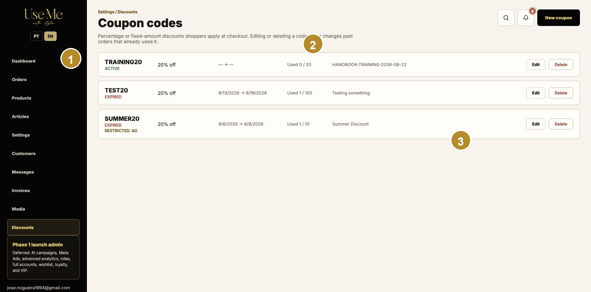

1 Lista e estado. 2 Tipo e valor. 3 Mercados, limites e datas.

### Criar um código

> **CONFIRMAR ANTES DE PUBLICAR**

1. Escolha Novo desconto e introduza um código simples; será guardado em maiúsculas.
2. Escolha Percentagem, Valor fixo ou Entrega grátis.
3. Defina Angola/Portugal, valores mínimos, datas, limite total e limite por email.
4. Guarde como ativo apenas depois de rever a campanha.
5. Teste no checkout dos mercados autorizados e confirme o resumo antes de anunciar.

### Desativar em vez de eliminar

> **AÇÃO DE ELEVADO IMPACTO**

1. Desative o código para terminar a campanha mantendo o histórico nas encomendas.
2. Elimine apenas códigos de teste sem utilização e sem valor histórico.

## 11. Artigos e guia de estilo

Artigos publica conteúdo editorial bilingue para captar procura, explicar a marca e ajudar clientes a escolher produtos.

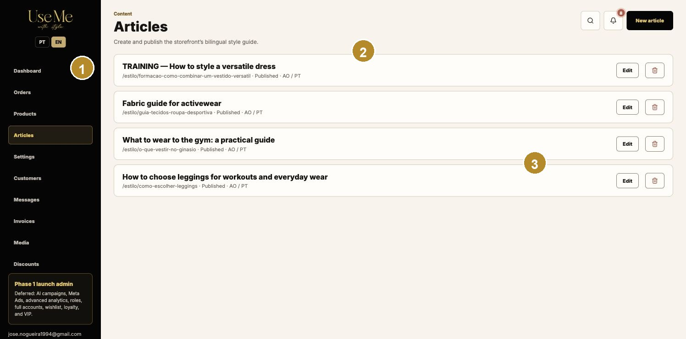

1 Rascunho/publicado. 2 Conteúdo bilingue estruturado. 3 SEO e disponibilidade por mercado.

### Criar e publicar um artigo

> **CONFIRMAR ANTES DE PUBLICAR**

1. Crie um artigo e preencha título, resumo, blocos e SEO em português e inglês.
2. Use secções com título, parágrafos e listas. Ordene os blocos na sequência de leitura.
3. Escolha os mercados onde deve aparecer.
4. Mantenha Rascunho durante a revisão. Publique e abra /estilo e o artigo nas duas lojas.
5. Confirme título, descrição, estrutura, ligações e leitura em telemóvel.

## 12. Conteúdo institucional

Definições > Conteúdo controla textos institucionais como Sobre nós, FAQ, Guia de tamanhos e outros conteúdos apresentados pela loja.

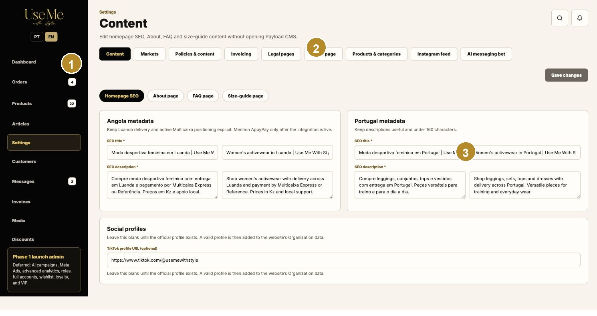

1 Área de conteúdo. 2 Campos PT/EN. 3 Guardar e confirmar na página pública.

### Editar conteúdo público

> **CONFIRMAR ANTES DE PUBLICAR**

1. Escolha a secção e altere apenas o texto necessário.
2. Preencha português e inglês. Não copie HTML ou formatação de fontes desconhecidas.
3. Guarde e abra a página pública correspondente em AO e PT.
4. Confirme títulos, acentos, ligações, espaçamento e versão móvel.

## 13. Mercados, pagamento, entrega e IVA

As definições de mercado afetam checkout, métodos, preços de entrega, limites e mensagens. Uma alteração incorreta pode impedir vendas ou cobrar valores errados.

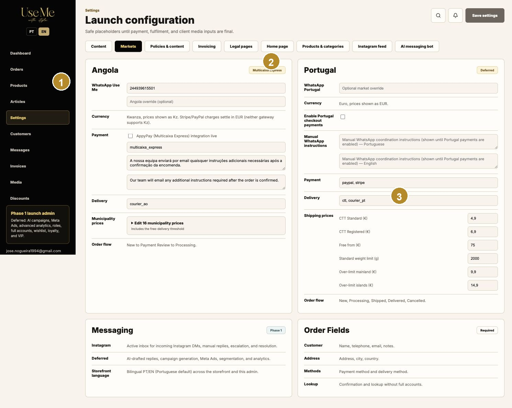

1 Angola. 2 Portugal. 3 WhatsApp alternativo, métodos e Guardar.

### Alterar uma definição de mercado

> **CONTACTAR O JOSÉ PRIMEIRO**

1. Registe o valor atual antes de alterar.
2. Mude apenas uma área de cada vez e verifique o botão Guardar.
3. Teste o checkout AO e PT até ao resumo, sem concluir uma compra real.
4. Confirme método, moeda, preço de entrega, limite grátis e instruções.

### Ativar WhatsApp alternativo

> **CONTACTAR O JOSÉ PRIMEIRO**

1. O fluxo WhatsApp deve permanecer configurado como alternativa caso AppyPay tenha um incidente.
2. Ative-o apenas com autorização operacional, confirme número e mensagem e faça um teste controlado.
3. Quando AppyPay recuperar, reverta a opção e teste novamente.

### Alterar IVA

> **CONTACTAR O JOSÉ PRIMEIRO**

1. Não altere taxas por tentativa. Confirme a obrigação legal e a região aplicável.
2. Registe a fonte, data de entrada em vigor e aprovação.
3. Teste um exemplo de preço e confirme subtotal sem IVA, IVA, total com IVA e entrega isenta.

## 14. Políticas, faturação e conteúdo legal

Estas áreas controlam políticas públicas, dados do emitente, IVA, instruções de pagamento, privacidade e termos.

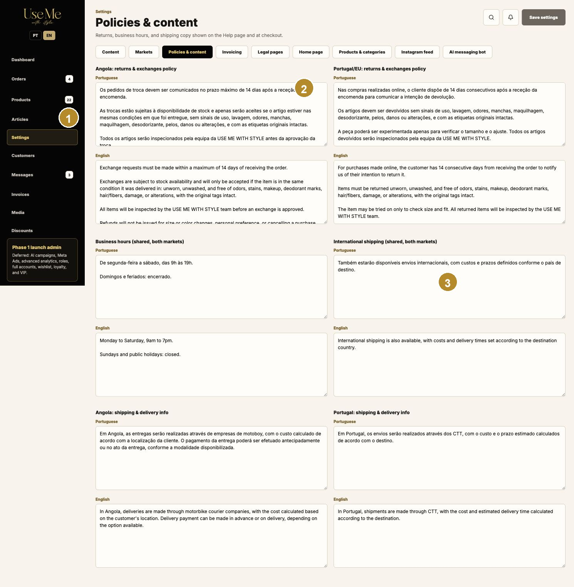

1 Políticas por mercado e idioma. 2 Dados de faturação. 3 Conteúdo legal.

### Editar políticas

> **CONFIRMAR ANTES DE PUBLICAR**

1. Abra Definições > Políticas e escolha a área correta.
2. Mantenha consistência entre Portugal e inglês, sem prometer algo que a operação não consegue cumprir.
3. Guarde e confirme Ajuda, FAQ, rodapé e checkout.

### Editar faturação

> **CONTACTAR O JOSÉ PRIMEIRO**

1. Confirme nome legal, NIF, morada, prefixo, IVA e dados bancários com documentos oficiais.
2. Nunca altere o prefixo ou sequência de documentos já emitidos sem orientação contabilística e técnica.
3. Faça um documento de teste e valide todas as linhas antes de usar em produção.

### Editar privacidade e termos

> **CONTACTAR O JOSÉ PRIMEIRO**

1. Use apenas texto aprovado.
2. Guarde uma cópia da versão anterior e registe a data de vigência.
3. Confirme as páginas públicas em ambos os idiomas.

## 15. Página inicial

Definições > Página inicial controla o hero, coleções e categorias apresentadas. As imagens desktop e mobile são enquadradas separadamente.

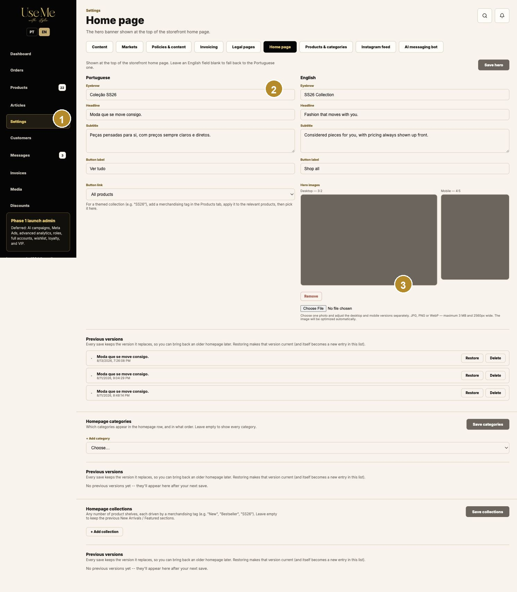

1 Texto bilingue e ligação. 2 Imagens desktop/mobile. 3 Seleção de categorias/coleções e versões.

### Atualizar o hero

> **CONFIRMAR ANTES DE PUBLICAR**

1. Preencha sobrancelha, título, subtítulo e botão em PT/EN.
2. Escolha a ligação do botão para catálogo, categoria ou destino suportado.
3. Carregue a imagem e ajuste primeiro desktop e depois mobile no editor.
4. Confirme as duas pré-visualizações. A imagem só é aplicada ao guardar o hero.
5. Abra a página inicial em desktop e telemóvel antes de terminar.

### Gerir versões

> **AÇÃO DE ELEVADO IMPACTO**

1. Cada gravação conserva versões anteriores da área apresentada.
2. Use Restaurar para voltar a uma versão confirmada.
3. Elimine versões antigas apenas quando tiver certeza de que não serão necessárias.

## 16. Instagram e apoio de IA

A área Instagram escolhe o destaque e associa produtos. A área de IA controla assistência limitada a mensagens, não decisões autónomas de venda.

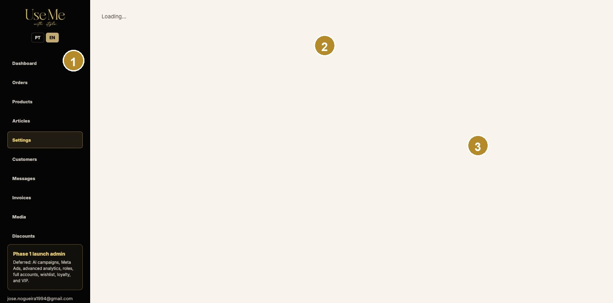

1 Publicação destacada. 2 Associação de produtos/variantes. 3 Estado e regras de IA.

### Destacar uma publicação

> **CONFIRMAR ANTES DE PUBLICAR**

1. Abra Definições > Instagram e aguarde o carregamento das publicações recentes.
2. Escolha uma publicação para o mosaico maior e associe produtos corretos.
3. Para variantes, confirme cor e tamanho exatos.
4. Guarde e confirme Shop Instagram em AO e PT.

### Configurar assistência de IA

> **CONTACTAR O JOSÉ PRIMEIRO**

1. Use apenas as opções disponibilizadas. Não altere tokens, modelos ou webhooks fora da administração.
2. Mantenha revisão humana para preço, stock, pagamentos, políticas, reclamações e dados sensíveis.
3. Se as respostas parecerem erradas, pause a automação e contacte o José.

## 17. Resolução de problemas

Faça primeiro verificações seguras. Não tente corrigir infraestrutura, base de dados, tokens, webhooks ou pagamentos diretamente.

### Uma gravação não aparece

> **AÇÃO SEGURA E ROTINEIRA**

1. Confirme se apareceu a mensagem de sucesso.
2. Recarregue a página da administração e verifique se o valor persistiu.
3. Abra a loja correta, AO ou PT, e confirme o idioma.
4. Atualize a loja uma vez. Se continuar incorreto, registe URL, hora, passos e captura.

### Uma imagem está desfocada ou cortada

> **AÇÃO SEGURA E ROTINEIRA**

1. Confirme o ficheiro original, formato e dimensões.
2. Reabra o editor de recorte e ajuste desktop/mobile separadamente quando disponível.
3. Evite ampliar uma imagem pequena para preencher uma área grande.

### Erro técnico ou indisponibilidade

> **CONTACTAR O JOSÉ PRIMEIRO**

1. Não repita ações de pagamento, eliminação ou envio.
2. Registe mercado, URL, utilizador, hora, mensagem de erro e captura.
3. Contacte o José por WhatsApp. A Raisa tem autoridade para pausar vendas quando necessário.

## 18. Uso restrito do Payload CMS

O Payload CMS em https://cms.usemewithstyle.shop/admin é a camada técnica de conteúdo e dados. A administração da loja deve ser usada para o trabalho diário.

### Quando entrar

> **CONTACTAR O JOSÉ PRIMEIRO**

1. Entre apenas quando uma tarefa necessária não existir na administração da loja e depois de confirmar com o José.
2. Não altere coleções técnicas, relações, utilizadores, configurações ou dados históricos por tentativa.
3. Nunca execute eliminação em massa, migração ou alteração de infraestrutura.

## 19. Funcionalidades diferidas e aceitação

A Fase 1 não inclui devoluções robustas, faturação fiscal certificada, pagamentos finais AppyPay/Paybird, contas completas, wishlist, fidelização, VIP, campanhas avançadas ou funções/roles avançadas.

### Aceitação do manual

> **CONFIRMAR ANTES DE PUBLICAR**

1. A Raisa executa tarefas representativas usando apenas o manual português durante a sessão gravada.
2. O José corrige qualquer hesitação causada por instrução incompleta ou imagem desatualizada.
3. O José aprova exatidão técnica; a Raisa aprova linguagem, facilidade e apresentação.
4. As duas versões recebem o mesmo número de versão e registo de alterações.
